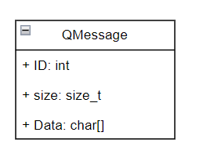
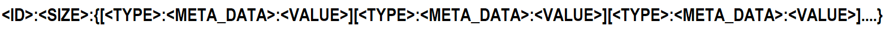
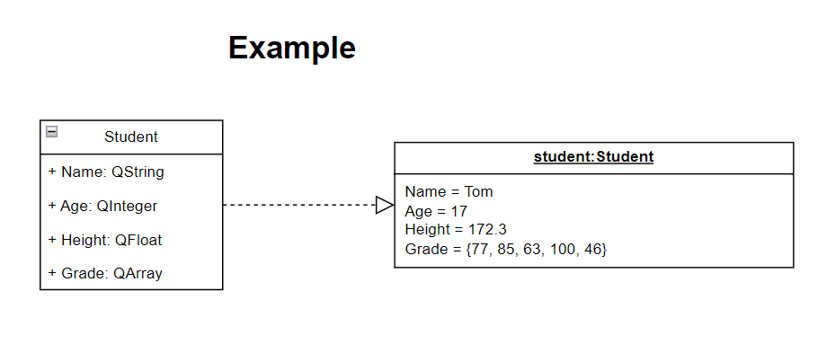

# Overview

## Feature
1. Simple Setting, just include source file (not link lib)
2. Light weight
3. Support various programming launguage

## Message Format








## Example

### Rust

#### Serialize

```
use super::qsm::*;

pub struct Person
{
    id : i64,
    name : QString,
    age : QInteger,
    height : QFloat,
    grade : QArray<i64>
}

impl MessageBuilder for Person
{
    fn message_build(mut self) -> QMessage {
        let mut _data = Vec::new();
        let mut _size = 0;

        _data.push(self.name.get_buffer());
        _size += self.name.get_buffer().len();

        _data.push(self.age.get_buffer());
        _size += self.age.get_buffer().len();

        _data.push(self.height.get_buffer());
        _size += self.height.get_buffer().len();

        _data.push(self.grade.get_buffer());
        _size += self.grade.get_buffer().len();
        
        let mut ret = QMessage::new(self.id,_size, _data);

        return ret
    }
}

impl Person {
    pub fn new(
        _id : i64,
        _name : QString,
        _age : QInteger,
        _height : QFloat,
        _grade : QArray<i64> ) -> Self {
        return Person { id: _id, name: _name, age: _age, height: _height, grade: _grade }
    }
}

pub fn TEST_Seriialize()
{

    let person = Person::new(1, QString::new("John".to_string()), QInteger::new(14), QFloat::new(172.3),
QArray::new(vec![10, 32, 47], QType::QInt));

    let mut person_message = person.message_build();

    println!("Id : {}", person_message.get_id().clone());
    println!("Size : {}", person_message.get_size().clone());
    println!("Message : {:?}", person_message.get_data());


    println!("Created Message : {}", seirialize(person_message));

}

```

#### Deserialize

```

pub fn TEST_Deseriialize()
{
    // Message -> Struct
    let person = Person::new(1, QString::new("John".to_string()), QInteger::new(14), QFloat::new(172.3),
QArray::new(vec![10, 32, 47], QType::QInt));
    let mut person_message = person.message_build();
    let mut s_message = seirialize(person_message);


    if let Some((id, size, data)) = deseirialize(s_message.as_str()) {
        let _data_vec = extract_data(data.as_str());
        let mut q_message = QMessage::new(id as i64, size as usize, _data_vec);

        println!("id = {}", q_message.get_id());
        println!("size = {}", q_message.get_size());
        println!("data = {:?}", q_message.get_data());

    } else {
        println!("Invalid input format");
    }
}

```


### C++

#### Serialize
```
    QInteger qInt(42);
    std::cout << qInt.get_buffer() << std::endl;

    QFloat qFloat(3.14);
    std::cout << qFloat.get_buffer() << std::endl;

    QString qString("Hello, World!");
    std::cout << qString.get_buffer() << std::endl;

    std::vector<int> vec = { 1, 2, 3, 4, 5 };
    QArray<int> qArray(vec, QType::QInt);
    std::cout << qArray.get_buffer() << std::endl;

    auto start = std::chrono::high_resolution_clock::now();

    std::vector<std::string> data = { qInt.get_buffer(), qFloat.get_buffer(), qString.get_buffer(), qArray.get_buffer() };
    QMessage qMessage(1, data.size(), data);
    std::cout << serialize(qMessage) << std::endl;

    auto end = std::chrono::high_resolution_clock::now();
    
    std::chrono::duration<double> duration = end - start;

    std::cout << "Execution time: " << duration.count() << " seconds" << std::endl;
```

#### DeSerialize
```
    auto ds_start = std::chrono::high_resolution_clock::now();

    std::string input = "123:456:Hello, world!";
    auto [id, size, ds_data] = deserialize(input);

    auto ds_end = std::chrono::high_resolution_clock::now();

    std::chrono::duration<double> ds_duration = ds_start - ds_end;
    std::cout << "Execution time: " << ds_duration.count() << " seconds" << std::endl;

    std::cout << "ID: " << id << "\n";
    std::cout << "Size: " << size << "\n";
    std::cout << "Data: " << ds_data << "\n";
```

### Python

#### Serialize
```

```
#### Deserialize
```

```

### Go

#### Serialize
```

```
#### Deserialize
```

```
