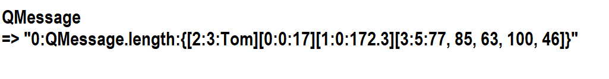

# Overview

## Feature
1. Simple Setting, just include source file (not link lib)
2. Light weight
3. Support various programming launguage

## Message Format




## Example

### Rust

#### Serialize

```
use super::qsm::*;

pub struct Person
{
    id : i64,
    name : QString,
    age : QInteger,
    height : QFloat,
    grade : QArray<i64>
}

impl MessageBuilder for Person
{
    fn message_build(mut self) -> QMessage {
        let mut _data = Vec::new();
        let mut _size = 0;

        _data.push(self.name.get_buffer());
        _size += self.name.get_buffer().len();

        _data.push(self.age.get_buffer());
        _size += self.age.get_buffer().len();

        _data.push(self.height.get_buffer());
        _size += self.height.get_buffer().len();

        _data.push(self.grade.get_buffer());
        _size += self.grade.get_buffer().len();
        
        let mut ret = QMessage::new(self.id,_size, _data);

        return ret
    }
}

impl Person {
    pub fn new(
        _id : i64,
        _name : QString,
        _age : QInteger,
        _height : QFloat,
        _grade : QArray<i64> ) -> Self {
        return Person { id: _id, name: _name, age: _age, height: _height, grade: _grade }
    }
}

pub fn TEST_Seriialize()
{

    let person = Person::new(1, QString::new("John".to_string()), QInteger::new(14), QFloat::new(172.3),
QArray::new(vec![10, 32, 47], QType::QInt));

    let mut person_message = person.message_build();

    println!("Id : {}", person_message.get_id().clone());
    println!("Size : {}", person_message.get_size().clone());
    println!("Message : {:?}", person_message.get_data());


    println!("Created Message : {}", seirialize(person_message));

}

```

#### Deserialize

```

```
